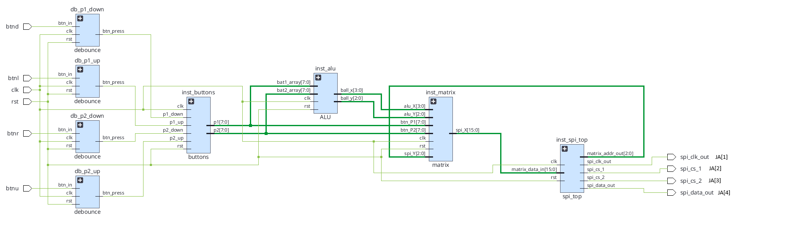
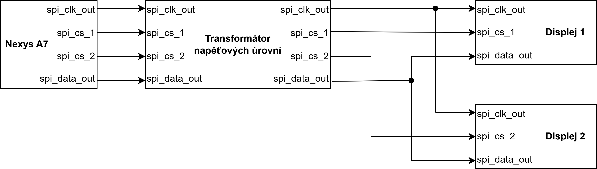
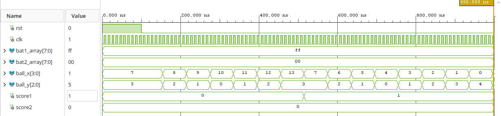
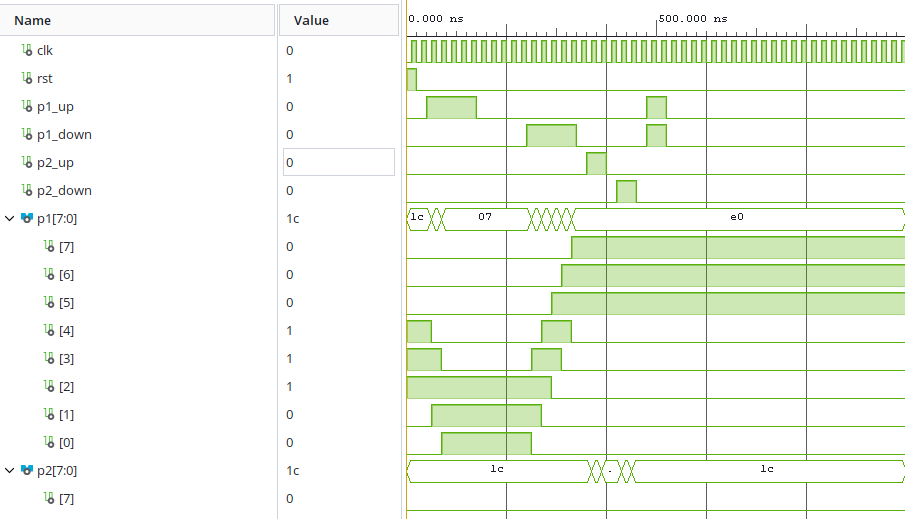
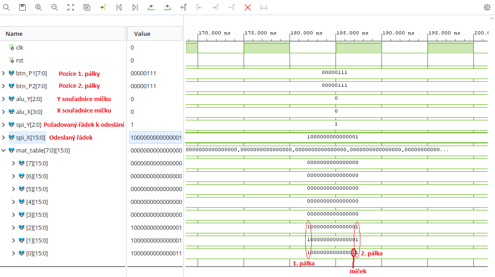

# 7. Uloha DE_1 Pong

Hra je zobrazena na 2 LED maticích 8×8, které spolu tvoří hrací plochu 16×8.

## Vstupy

clk - systémový hodinový signál  
btnc - rst - reset systému

btnl - pohyb pálky hráče 1 nahoru  
btnd - pohyb pálky hráče 1 dolů  
btnu - pohyb pálky hráče 2 nahoru  
btnr - pohyb pálky hráče 2 dolů

## Výstupy

ja[1] - data_out - sériová datová linka pro MAX7219  
ja[2] - clk_out - hodinový signál pro přenos dat  
ja[3] - cs1 - výběr prvního LED driveru  
ja[4] - cs2 - výběr druhého LED driveru

## Popis projektu

Program zpracovává tlačítka obou hráčů, řídí pohyb pálek a míčku a vytváří obraz hry pro LED matice.

Míček se pohybuje po hrací ploše, odráží se od stěn a od pálky. Pokud hráč míček netrefí, bod získá protihráč a hra se restartuje.

## Popis komponent

### ALU
Počítá pohyb míčku po hrací ploše a určuje, jestli hráč zasáhl míček pálkou.
Pokud hráč míček nezasáhne, tak automaticky restartuje hru.

### Buttons
Ovládá pálky.
Každý hráč může mačkáním tlačítek pohybovat pálkou nahoru a dolů.
Polohu pálek dále zpracovává ALU a Matrix

### Matrix
Pomocí pozice míčku od ALU a pozice pálek od Buttons virtuálně zobrazuje hrací pole.
Přijímá číslo požadovaných sloupců od SPI a obratem mu je posílá.

### SPI
Obsluhuje externí displeje.
Jako vstup má vektor rozsvícení LEDek.
Displeje se ovládají pomocí obvodu MAX7219.
Ze vstupních dat vytvoří výstupní řetězec, který obsahuje číslo sloupce a které LEDky jsou rozsvícené/zhasnuté.

### Hardware
Deska Nexys A7-50T

Tlačítka na desce

2 externí LED displeje

Deska Arduino na napájení
